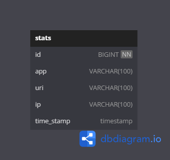

# java-explore-with-me

## Модель базы данных основного сервиса

## Модель базы данных сервиса статистики

## Пример реализации методов взаимодействия между сервисами 
#### основной сервис обращается к клиенту сервиса статистики и направляет запрос на сохранение данных в сервисе статистики, 

    @Override
    public void addHit(HttpServletRequest httpServletRequest) {
        statsClient.addHit("main-service",
                httpServletRequest.getRequestURI(),
                httpServletRequest.getRemoteAddr(),
                LocalDateTime.parse(LocalDateTime.now().format(CommonUtils.FORMATTER), CommonUtils.FORMATTER));
    }

#### основной сервис отправляет запросы клиенту сервиса статистики и получает ответы c ранее сохраненными данными 

    @Override
    public List<ViewStats> getStats(LocalDateTime start, LocalDateTime end, List<String> uris, Boolean unique) {
        ResponseEntity<Object> response = statsClient.getStats(start, end, uris, unique);
        try {
            return Arrays.asList(objectMapper.readValue(objectMapper.writeValueAsString(response.getBody()), ViewStats[].class));
        } catch (IOException e) {
            throw new ClassCastException(e.getMessage());
        }
    }
